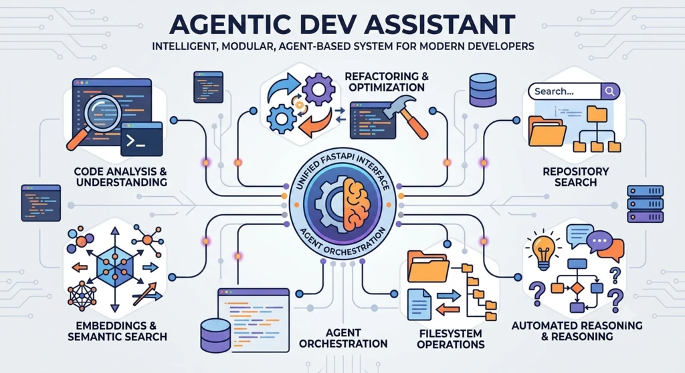

# Agentic Dev Assistant


[](https://opensource.org/licenses/MIT)
[](https://www.python.org/)
[](https://github.com/astral-sh/uv)
[](https://fastapi.tiangolo.com/)
[](ca://s?q=How_was_this_README_generated)





## 📋 Problem Statement

Modern developers face increasingly complex workflows: code analysis, refactoring, repository search, embeddings, filesystem operations, and multi‑agent orchestration.
The Agentic Dev Assistant provides an intelligent, modular, agent‑based system capable of automating these tasks through a unified FastAPI interface.

This project demonstrates how LLM‑powered agents can collaborate to perform developer‑centric tasks such as code understanding, repository indexing, semantic search, and automated reasoning.

---


## 🎯 Objectives

- Build a modular multi‑agent architecture (Echo, Embeddings, Git, Filesystem, Code Analysis, Refactor).

- Provide a unified Orchestrator capable of routing queries to the right agent.

- Enable semantic search through embeddings and repository indexing.

- Offer a clean, testable, production‑ready FastAPI backend.

- Ensure reproducibility with Docker and modern Python tooling (uv).

- Provide a foundation for future extensions (RAG, code execution, auto‑fixing, etc.).

---

## 🧠 Approach

- **Agent‑based architecture**: each agent handles a specific domain (code, embeddings, git, filesystem…).

- **Embeddings Engine** for semantic search and repository indexing.

- **Orchestrator** that interprets queries and delegates to the appropriate agent.

- **FastAPI** for serving the agentic system through REST endpoints.

- **uv** for fast dependency management and isolated environments.

- **Docker** for reproducible deployment.

----

## 🧩 Features

- **Multi‑Agent System:**  
    Echo, Embeddings, Git, Filesystem, Code Analysis, Refactor

- **Semantic Search:**  
    Repository indexing + embeddings + similarity search

- **FastAPI Endpoints:** 
```
    /orchestrator/run?query=...
```
- **Modular Architecture:**  
    Add new agents with minimal boilerplate

---


## 📁 Project Structure

```
agentic-dev-assistant/
├── app/
│   ├── agents/
│   │   ├── base_agent.py
│   │   ├── echo_agent.py
│   │   ├── embeddings_agent.py
│   │   ├── git_agent.py
│   │   ├── file_system_agent.py
│   │   ├── code_analysis_agent.py
│   │   ├── refactor_agent.py
│   │   └── llm_agent.py
│   ├── core/
│   │   ├── config.py
│   │   ├── embeddings.py
│   │   └── logger.py
│   ├── orchestrator/
│   │   └── orchestrator.py
│   ├── routers/
│   │   ├── llm.py
│   │   └── orchestrator.py
│   └── main.py
├── data/
│   └── embeddings.pkl
├── scripts/
│   └── index_repo.py
├── tests/
│   ├── agents/
│   ├── core/
│   └── routers/
├── Dockerfile.dev
├── Dockerfile.prod
├── docker-compose.yml
├── pyproject.toml
└── README.md
```

---

## ⚙️ Prerequisites

- Python 3.12+
- uv (recommended)
- Docker & Docker Compose
- FastAPI
- LLM provider (Groq, OpenAI, etc.)

### 🖥️ Setup (uv)

Install uv:
```bash
curl -LsSf https://astral.sh/uv/install.sh | sh
```

Create and sync environment:

```bash
uv venv
uv sync
```

Activate:

```bash
source .venv/bin/activate
```

Run the API:
```bash
uv run uvicorn app.main:app --reload
```

🐳 Docker Commands
```bash
# Build
docker compose build

# Run
docker compose up -d

# Logs
docker compose logs -f web

# Exec into container
docker compose exec web sh
```

### 🚀 Run Locally

Start the API:
```bash
uv run uvicorn app.main:app --reload
```
Or with Docker:

```bash
docker compose up --build
```

Access the API docs:

👉 http://localhost:8000/docs

### 🧪 Running Tests

Using uv inside Docker:
```bash
docker compose exec web uv run pytest -q
```
---

## ✨ Contributing

1. Fork the repository
2. Create a new branch (`git checkout -b feature/your-feature`)
3. Make your changes
4. Commit your changes (`git commit -am 'feat: Add some feature'`)
5. Push to the branch (`git push origin feature/your-feature`)
6. Create a new Pull Request

---

## 📄 License


This project is under the **MIT License**. See [LICENSE](LICENSE) for more details.


---


## 👤 Author


**Jean-Michel LIEVIN**  
Data & IA Enthusiast | Full Stack Senior (10+ years)

- 🌐 Portfolio: [jean-michel-lievin.github.io](https://jean-michel-lievin.github.io)
- 💼 LinkedIn: [linkedin.com/in/jean-michel-lievin](https://www.linkedin.com/in/jean-michel-lievin)
- 📧 Email: [jmichel.lievin@gmail.com](mailto:jmichel.lievin@gmail.com)

---

## 🛠️ Support

For issues and questions, open an issue on GitHub.

[](mailto:jmichel.lievin@gmail.com)
[](https://github.com/jean-michel-lievin/agentic-dev-assistant/issues)